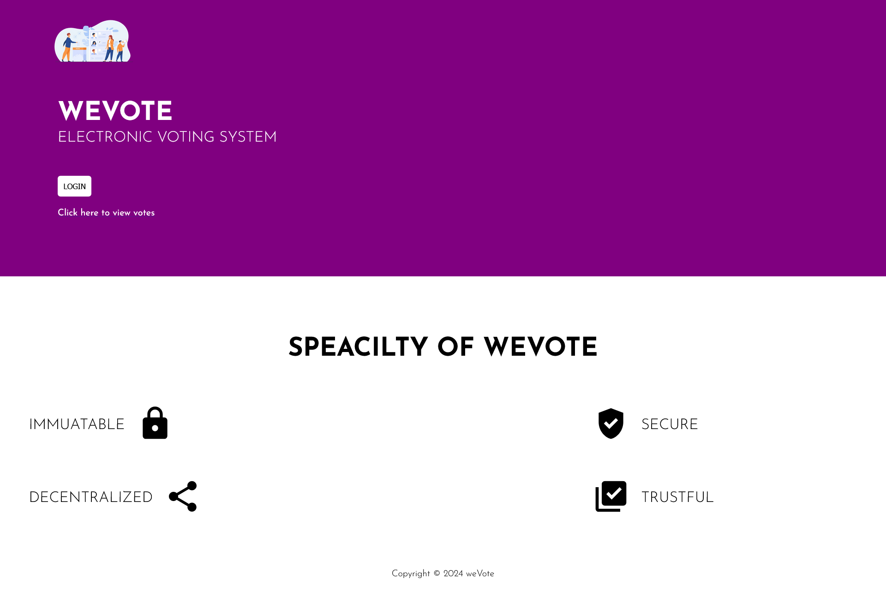
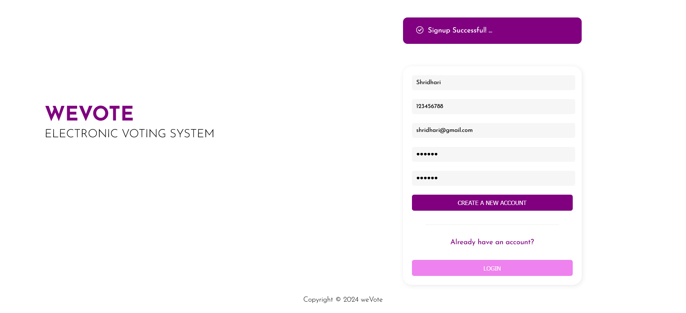
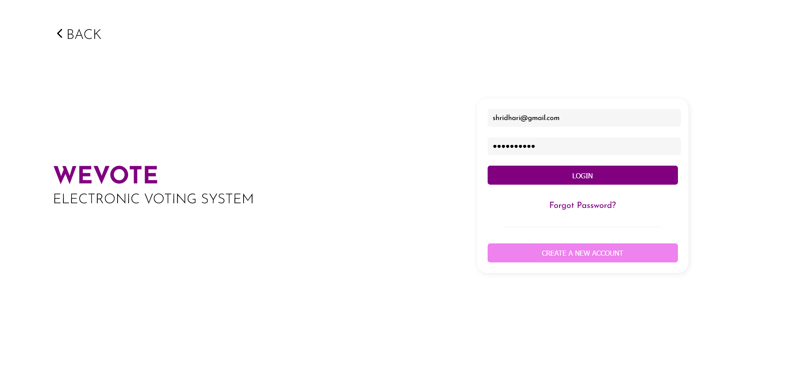
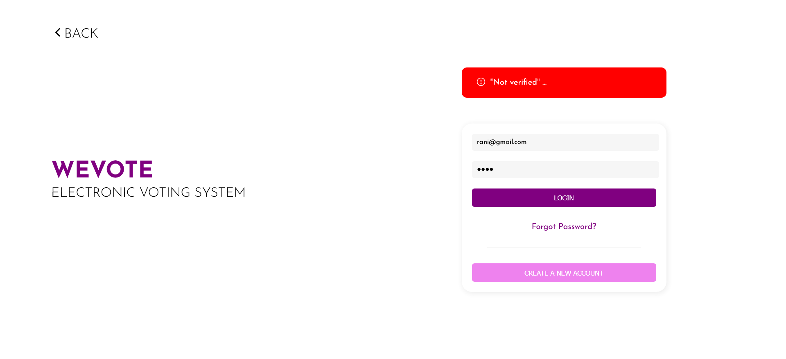
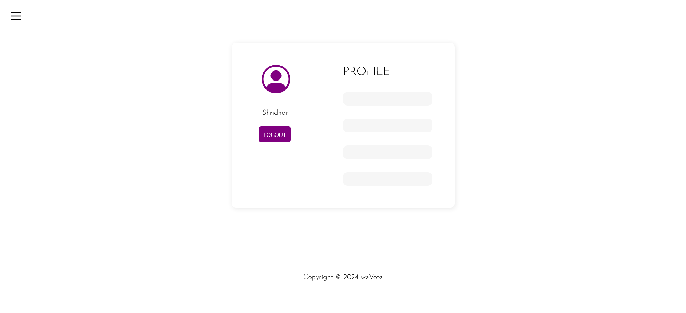
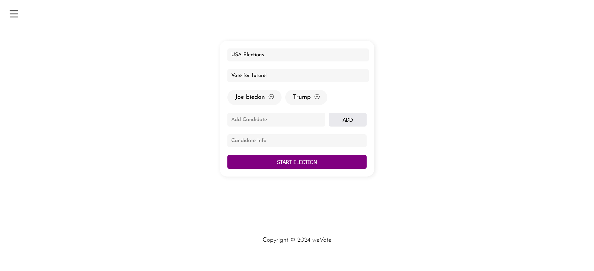
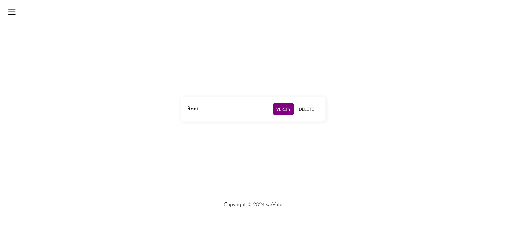
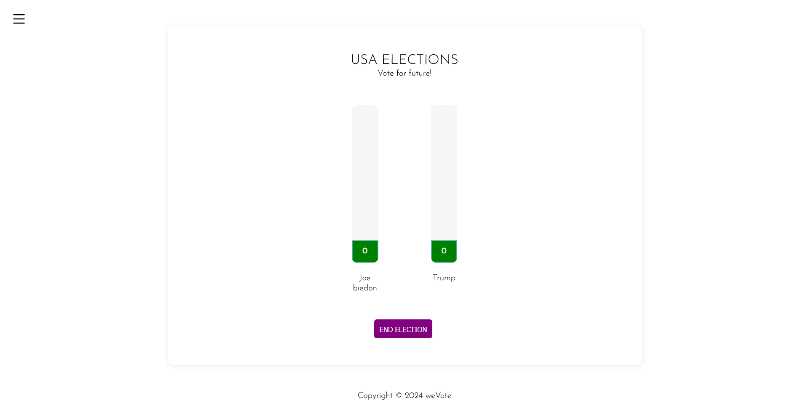
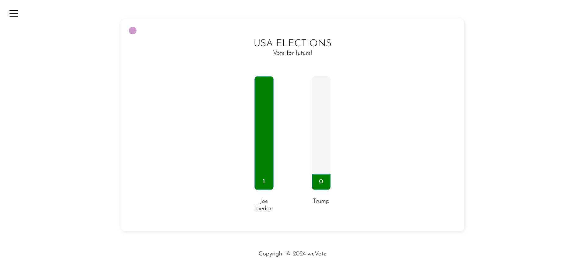

# 🗳️ Decentralized Voting  (weVote)

## Introduction
This project is a decentralized voting platform built using blockchain technology to ensure secure, transparent, and immutable elections. It features two main roles: **Admin** and **Voter**. Voters need to create and verify their accounts before participating in elections, while admins manage the polls and elections.


## Technology Stack
- **TypeScript**
- **Solidity**
- **React**
- **Ganache**
- **MySQL**

## Key Features
- **🔏 Voter Account Verification**: Voters must verify their accounts to vote.
- **🗳️ Single Vote Enforcement**: Ensures each voter can only vote once.
- **📅 Election Management**: Admins can create, manage, and end elections.
- **🔒 Immutable Voting Records**: Uses blockchain to secure votes.
- **📊 Live Vote Tracking**: Real-time tracking of votes.

## System Modules
### Admin Capabilities
- Create and manage polls
- End elections
- Verify voter accounts

### Voter Capabilities
- Create and verify account
- Login to vote
- Cast a single vote per election

## Getting Started
### Installation Steps
1. **Clone the Repository**
    ```bash
    git clone https://github.com/your-friend-repo/blockchain-voting-system.git
    cd blockchain-voting-system
    ```

2. **Install Required Dependencies**
    ```bash
    npm install
    ```

3. **Launch Ganache**
    ```bash
    ganache-cli
    ```

4. **Compile and Deploy Smart Contracts**
    ```bash
    truffle compile
    truffle migrate
    ```

5. **Start the Application**
    ```bash
    npm start
    ```

## How to Use
### Home Page


### User Registration


### User Login


### Unverified Login Attempt


### User Profile


### Admin Functions
- **Create Poll**
    
- **Verify Users**
    
- **Vote Administration**
    

### Voting Process


